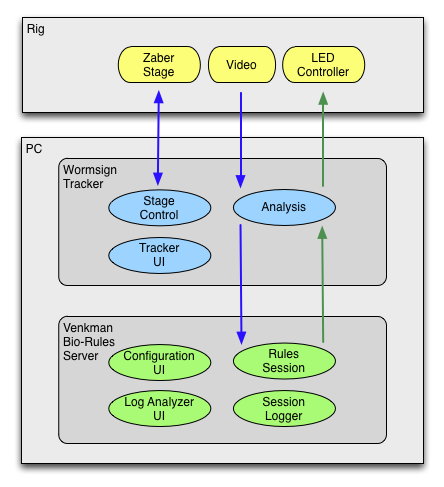

Venkman 

Software Developed By:
Scientific Computing Group
HHMI Janelia Research Campus, Ashburn, VA, USA

For bug reports/comments/feedback, e-mail: mlouis_at_crg.eu or matthieu.louis_at_icloud.com

=======

##Overview

Venkman allows researchers to create “bio-rules” - olfactory experience paradigms based on a larva's current behavior.  
Several bio-rules are supported, enabling a multitude of virtual reality paradigms that broadly fall into categories of time-based, position-based, and/or behavior-based protocols.  
Venkman does this by interfacing with the Wormsign tracking application.  

The following diagram depicts the high level hardware and software components in the system:
 

 
The bio-rules server accepts body-state measurements such as head, neck and tail positions, head to body angle, and tail bearing from the Wormsign computer vision and tracking algorithm.  
Depending on the VR paradigm chosen by the user for the experiment, these data are used to determine the appropriate stimulus intensity for the current frame.  
The stimulus information is then sent back to Wormsign, which relays the command to the LEDs.
 
##Code / Build Process
 
Venkman is written in Java and was developed using the [IntelliJ IDE](https://www.jetbrains.com/idea/).

IntelliJ should be used to compile and run automated tests.
An ant target 'jar-server' can be used to bundle the compiled results into a jar for deployment.
  
##License

Use is subject to Janelia Research Campus Software Copyright 1.2 license terms 
( [http://license.janelia.org/license/janelia_copyright_1_2.html](http://license.janelia.org/license/janelia_copyright_1_2.html) ).

